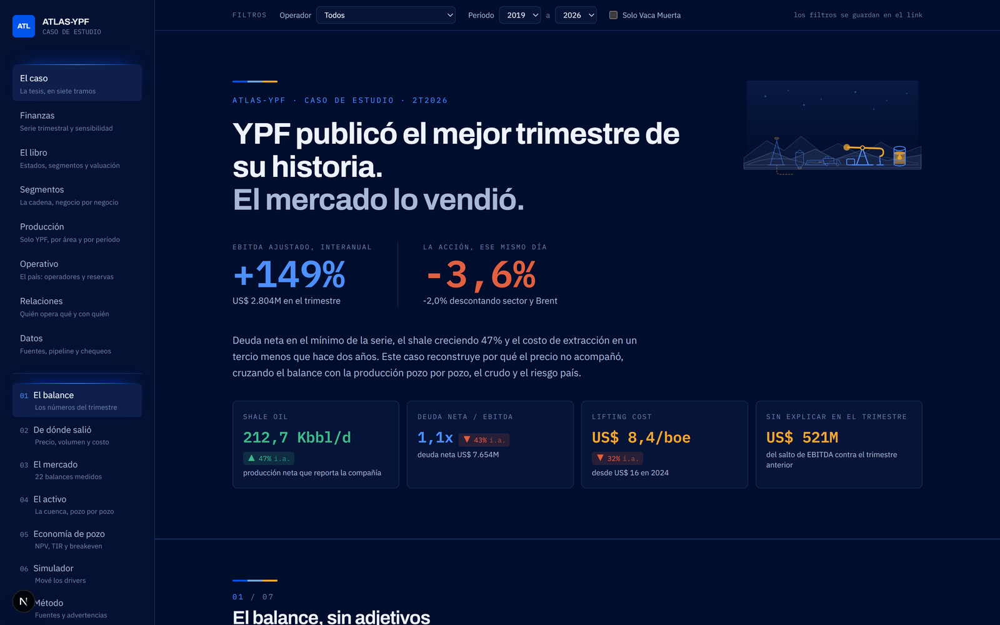
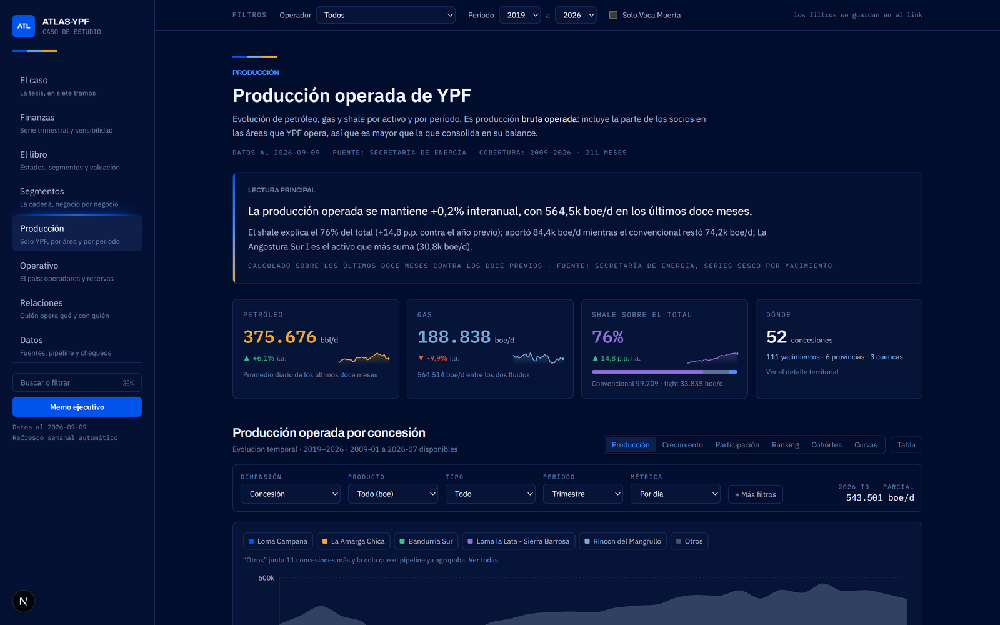
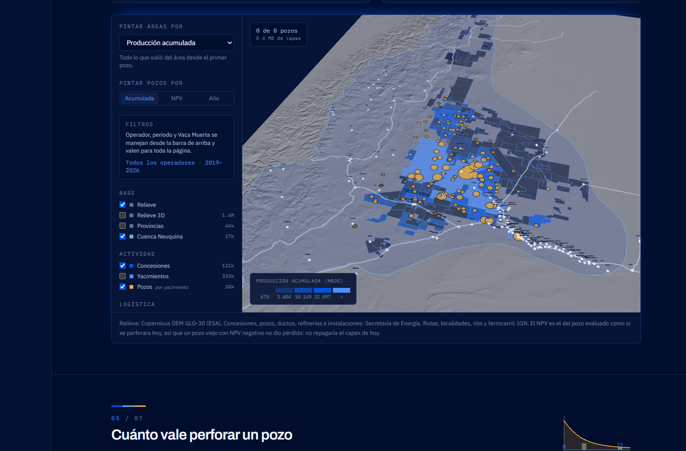
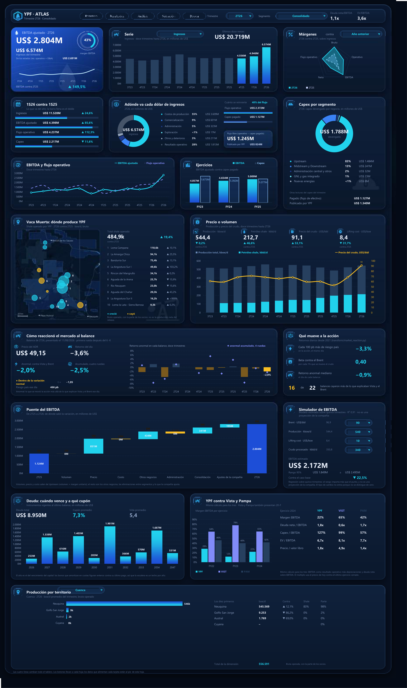
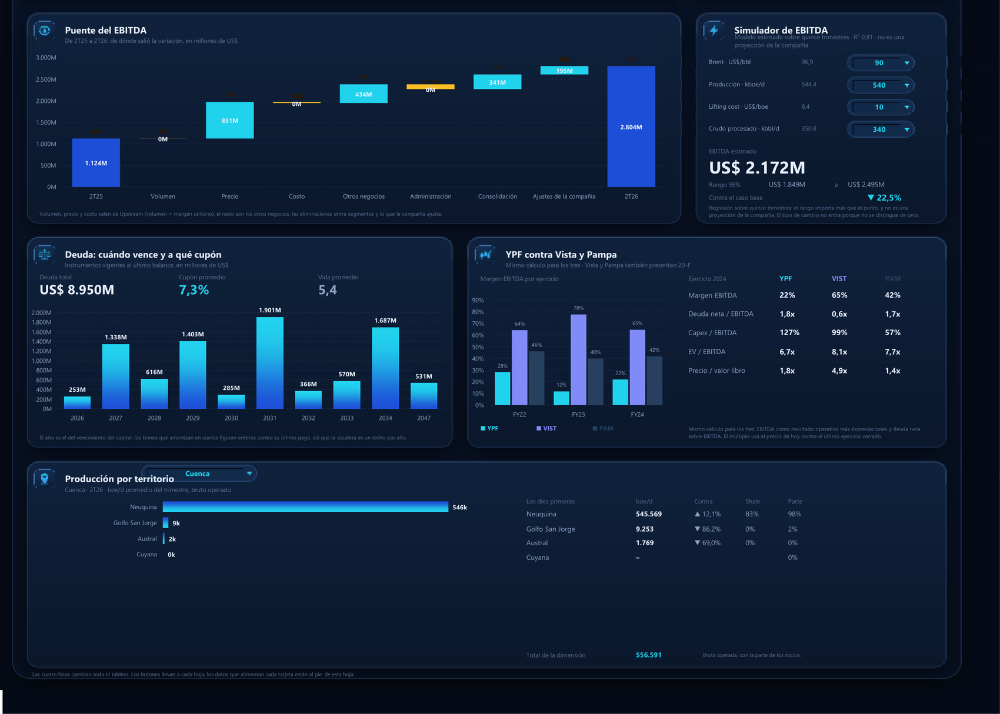
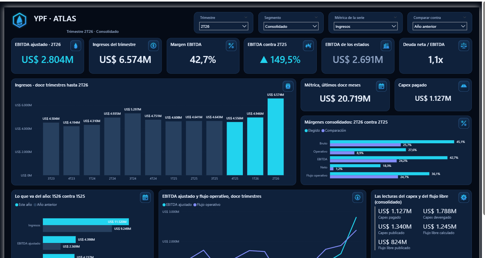
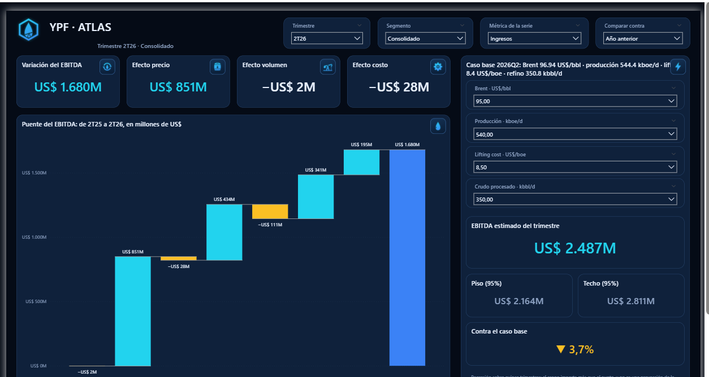
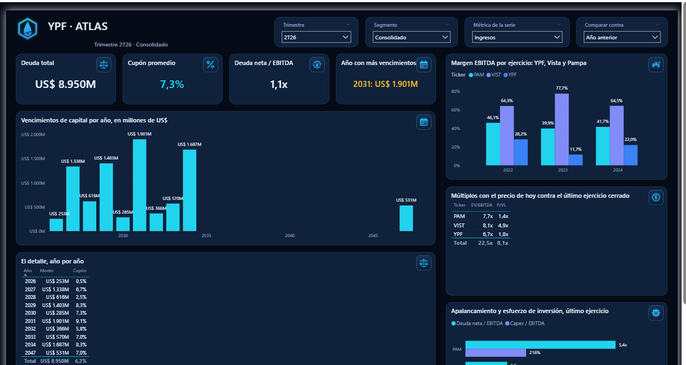

# ATLAS-YPF

Caso de estudio: **YPF publicó el mejor trimestre de su historia y el mercado lo vendió.**

En el 2T26 la compañía reportó un EBITDA ajustado de US$ 2.804M, 149% arriba del año anterior,
y la acción cayó 3,6% ese mismo día. Este repositorio reconstruye por qué, cruzando los estados
contables con la producción pozo por pozo, el precio del crudo, la deuda, los comparables del
sector y la reacción del mercado.

La respuesta corta está en el puente del EBITDA: de los US$ 1.680M de aumento interanual,
**US$ 851M son precio**. El volumen aportó −2M y el costo −28M. Un récord que se explica por el
ciclo, no por la compañía, se paga distinto: YPF cotiza a 6,7x EV/EBITDA contra 8,1x de Vista y
7,7x de Pampa.

Los mismos datos se sirven en tres superficies, todas alimentadas por el mismo pipeline.

---

## La plataforma web

Next.js sobre Vercel, en la ruta `/ypf-project` del portfolio. Siete tramos que van del balance
al pozo, con filtros que se guardan en el link.



El módulo de producción abre la serie por concesión, yacimiento, cuenca, provincia o localidad,
con datos mensuales desde 2009.



El mapa de la cuenca es deck.gl sobre el relieve real del DEM de Copernicus: concesiones,
yacimientos y 5.089 pozos con su producción acumulada y su valor actual neto.



## El tablero de Excel

Una hoja del libro de estados contables, interactiva y sin una sola macro: cuatro listas
desplegables gobiernan todo, las tarjetas son una imagen generada con Pillow y los gráficos son
nativos de Excel. Ningún número está escrito a mano; todos salen de fórmulas contra las hojas de
estados, que se pueden auditar celda por celda.



Abajo, las cinco tarjetas de análisis: el puente del EBITDA, el simulador de escenarios, el
perfil de vencimientos de la deuda, los comparables y la producción por territorio.



## El tablero de Power BI

El mismo tablero como proyecto PBIP: el modelo en TMDL y el reporte en JSON por visual, todo
texto versionable que genera `pipeline/export/powerbi_tablero.py`. Cinco páginas con los filtros
sincronizados.



El puente del EBITDA en cascada y el simulador, que mueve Brent, producción, lifting cost y
crudo procesado sobre un modelo estimado con quince trimestres.



La deuda y los comparables: cuándo vence cada bono, a qué cupón, y cómo se ve YPF al lado de
Vista y Pampa con la misma cuenta para los tres.



---

## Cómo está armado

```
pipeline/ingest/      una fuente por script, nunca mezcladas
pipeline/transform/   todo cálculo vive acá, y solo acá
pipeline/export/      las salidas de presentación: Excel y Power BI
pipeline/checks.py    invariantes: si algo no cierra, el pipeline queda en rojo
web/                  el módulo Next.js que se integra al portfolio
powerbi/              el proyecto PBIP
docs/                 el libro de estados contables y las capturas
```

Todo se corre con:

```bash
python pipeline/run_all.py            # ingesta, transforms, exportaciones y chequeos
python pipeline/run_all.py --skip-ingest   # sin tocar la red
```

Las reglas que se respetan en todo el repo: los datos crudos no se commitean, el frontend
consume solo `data/processed/`, y las salidas de presentación leen pero no calculan.

## Los chequeos

`pipeline/checks.py` corre catorce invariantes sobre lo que quedó en `data/processed/`: que las
partes sumen el total, que ningún operador produzca más que el país, que las cinco dimensiones
del territorio den lo mismo, que el puente del EBITDA cierre contra la variación publicada. No
verifican que el dato sea correcto: verifican que no sea imposible.

## Las fuentes

| Qué | De dónde |
|---|---|
| Estados contables y segmentos | SEC EDGAR: 20-F y 6-K de YPF |
| Highlights del trimestre | Earnings release de la compañía |
| Producción por pozo | Secretaría de Energía (capítulo IV y series SESCO) |
| Reservas | Secretaría de Energía |
| Geoespacial | IGN, y el DEM GLO-30 de Copernicus para el relieve |
| Mercado | Precio del ADR, Brent y WTI |
| Macro | EMBI Argentina y tipo de cambio |
| Comparables | 20-F de Vista Energy y Pampa Energía |
